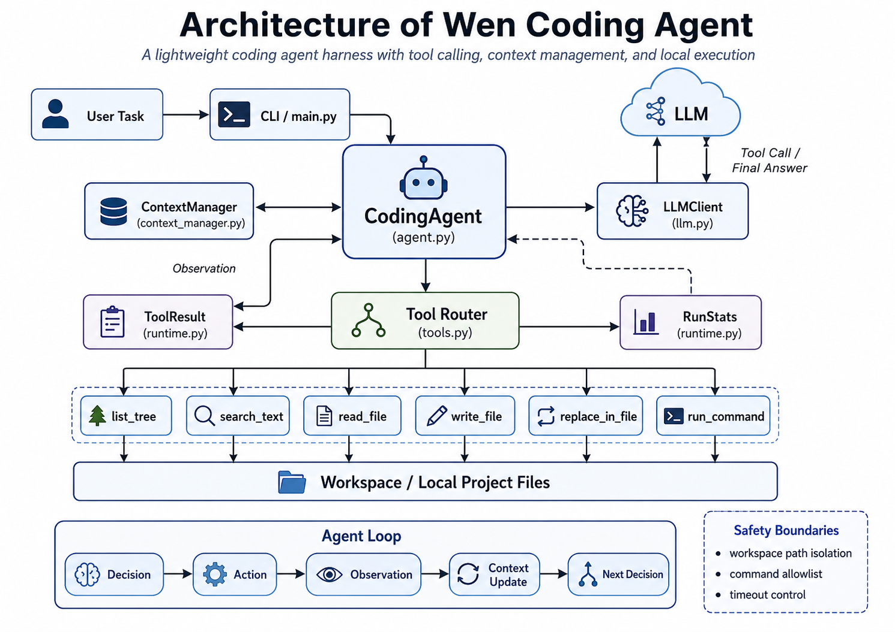

# Wen Coding Agent





一个从零实现的轻量级 Coding Agent Harness。

本项目实现了一个类似简化版 Claude Code / Codex / OpenCode 的编程智能体。Agent 通过大语言模型原生 Tool Calling，自主读取代码、搜索项目、修改文件、执行本地测试与开发命令，并根据工具返回结果持续决策，直到完成编程任务。

本项目重点不是调用现成 Agent 框架，而是自行实现 Coding Agent 的核心 Harness 机制。

---

## 一、主要功能

### 1. Agent 运行机制

- 自行实现 Agent Loop
- 使用模型原生 Tool Calling
- 支持多轮自主任务执行
- 支持最大执行步数限制
- 支持重复 Tool Call 检测，避免明显死循环
- 工具执行失败后不会直接退出，而是作为 Observation 返回模型继续决策

### 2. 项目理解能力

- 递归查看项目目录树
- 全项目文本搜索
- 根据符号、函数名、错误信息等定位代码
- 支持按行号范围读取代码
- 自动忽略常见缓存、依赖和生成目录

### 3. 代码修改能力

- 创建和覆盖 UTF-8 文本文件
- 精确替换指定代码片段
- 优先进行小范围修改，减少无关改动
- 记录本轮任务修改过的文件

### 4. 本地验证能力

- 执行 pytest、Python、编译器等开发命令
- 命令执行超时控制
- 可执行程序白名单
- 使用 `shell=False` 执行命令
- 根据进程退出码判断命令成功或失败
- 统计最终验证结果

### 5. 上下文管理

- 保留 System Prompt
- 保留用户原始任务
- 保留最近若干完整 Agent Step
- 按完整 Tool Call / Tool Result 交互块裁剪历史
- 避免上下文截断导致工具调用与工具结果失配

### 6. 模型接口

- 支持 OpenAI-compatible API
- 模型、API 地址和 Key 均通过环境变量配置
- 模型调用逻辑与 Agent Loop 解耦

---

## 二、整体架构

```text
                         用户任务
                            |
                            v
                      +-------------+
                      | CodingAgent |
                      +------+------+
                             |
                +------------+------------+
                |                         |
                v                         v
         ContextManager               LLMClient
                ^                         |
                |                         v
                |                        LLM
                |                         |
                |                     Tool Call
                |                         |
                |                         v
                |                    Tool Router
                |                         |
                |       +-----------------+----------------+
                |       |        |        |        |      |
                |       v        v        v        v      v
                |      Tree    Search    Read     Edit  Command
                |       |        |        |        |      |
                |       +-----------------+----------------+
                |                         |
                |                         v
                |                    ToolResult
                |                         |
                |             +-----------+-----------+
                |             |                       |
                |             v                       v
                +------ Observation              RunStats
```

核心循环：

```text
模型判断下一步操作
        ↓
生成 Tool Call
        ↓
Harness 解析参数
        ↓
本地执行工具
        ↓
返回 Tool Result / Observation
        ↓
更新上下文
        ↓
模型继续判断
        ↓
直到任务完成
```

---

## 三、当前工具

| 工具 | 功能 |
|---|---|
| `list_files` | 查看指定目录下一层文件 |
| `list_tree` | 递归查看项目目录结构 |
| `search_text` | 在项目中搜索文本、函数名、错误信息等 |
| `read_file` | 按指定行号范围读取源码 |
| `write_file` | 创建或覆盖文本文件 |
| `replace_in_file` | 精确替换某一段代码 |
| `run_command` | 执行允许的本地开发命令 |

所有文件工具都限制在 `workspace/` 目录中。

---

## 四、项目结构

```text
wen-coding-agent/
│
├── main.py
├── agent.py
├── llm.py
├── runtime.py
├── context_manager.py
├── tools.py
├── config.py
├── prompts.py
│
├── requirements.txt
├── .env.example
├── .gitignore
├── README.md
│
├── examples/
│   └── order_service_demo/
│       ├── app.py
│       ├── inventory.py
│       ├── order_parser.py
│       ├── pricing.py
│       ├── validator.py
│       └── tests/
│
└── workspace/
    └── .gitkeep
```

其中：

```text
examples/
```

用于保存可复现的演示项目。

```text
workspace/
```

是 Agent 实际运行时的工作目录。

---

## 五、环境要求

- Python 3.10+
- 支持 OpenAI-compatible Tool Calling 的大语言模型 API

安装依赖：

```bash
pip install -r requirements.txt
```

---

## 六、模型配置

通过环境变量配置模型。

必需：

```text
LLM_API_KEY
LLM_MODEL
```

如使用第三方 OpenAI-compatible 服务，还需要：

```text
LLM_BASE_URL
```

可选配置：

```text
MAX_STEPS=20
MAX_CONTEXT_STEPS=8
COMMAND_TIMEOUT=30

MAX_READ_LINES=400
MAX_TREE_ENTRIES=300
MAX_SEARCH_RESULTS=50
```

PowerShell 示例：

```powershell
$env:LLM_API_KEY="YOUR_API_KEY"
$env:LLM_BASE_URL="https://your-provider.example/v1"
$env:LLM_MODEL="your-model-name"
```

API Key 不应写入代码或提交到 Git 仓库。

---

## 七、运行方法

将需要 Agent 处理的项目放入：

```text
workspace/
```

然后执行：

```bash
python main.py
```

终端会进入交互模式：

```text
============================================================
Mini Coding Agent
============================================================

Workspace: .../workspace

>
```

输入编程任务，例如：

```text
Inspect this project, identify the root causes of all failing tests,
make minimal fixes, and run the full pytest suite until all tests pass.
```

Agent 会自主执行：

```text
查看项目结构
    ↓
运行测试
    ↓
定位相关代码
    ↓
读取源码
    ↓
修改代码
    ↓
再次运行测试
    ↓
根据结果继续调试或结束
```

---

## 八、演示项目

仓库提供了一个简单的订单处理项目：

```text
examples/order_service_demo/
```

该项目包含多个独立实现错误和对应 pytest 测试，可用于演示 Agent 的项目分析、代码定位、修改和验证过程。

复制到工作目录：

```powershell
Get-ChildItem workspace -Force |
Where-Object { $_.Name -ne ".gitkeep" } |
Remove-Item -Recurse -Force

Copy-Item -Recurse -Force examples\order_service_demo\* workspace\
```

然后运行：

```powershell
python main.py
```

推荐任务：

```text
Inspect this project, identify the root causes of all failing tests,
make minimal fixes, and run the full pytest suite until all tests pass.
```

---

## 九、运行结果统计

每次任务结束后，Agent Harness 会输出基本运行统计，例如：

```text
============================================================
RUN SUMMARY
============================================================

Steps:             9
Tool calls:        12
Successful tools:  10
Failed tools:      2
Files changed:     inventory.py, order_parser.py, pricing.py
Last command:      pytest -q
Verification:      PASSED
```

这些结果由 Harness 自身记录，而不是仅依赖模型最终回答判断。

---

## 十、安全设计

### 1. Workspace 路径限制

所有文件访问都限制在：

```text
workspace/
```

例如：

```text
../../Windows/System32
```

这种试图访问工作目录外部的路径会被拒绝。

### 2. 命令执行限制

命令使用：

```python
shell=False
```

执行，并限制只能调用允许的开发工具。

同时支持命令超时，避免长时间阻塞。

### 3. 安全边界

当前实现提供的是：

- 文件路径限制
- 命令级白名单
- 超时控制

但它并不是操作系统级强隔离沙箱。

如果用于实际生产环境，应进一步使用 Docker、虚拟机、低权限用户等方式进行隔离。

---

## 十一、上下文管理

随着 Agent 不断执行工具，历史消息会逐渐增长。

本项目自行实现 `ContextManager`，始终保留：

```text
System Prompt
用户原始任务
最近若干完整 Agent Step
```

历史裁剪时不会简单按消息数量截断，而是按完整交互块处理：

```text
Assistant Tool Call
        +
Tool Result
```

这样可以避免 Tool Call 和对应 Tool Result 被拆开，导致模型 API 上下文格式错误。

---

## 十二、设计原则

本项目主要遵循以下原则：

### 1. Agent Loop 尽量透明

模型决策、本地执行、结果反馈和下一轮决策之间的关系应当清晰可见。

### 2. 模型负责决策，Harness 负责执行

LLM 只能提出动作请求，真正的文件操作和命令执行由本地 Harness 完成。

### 3. 优先最小修改

对于已有代码，尽量通过局部替换完成修改，而不是无必要地覆盖整个文件。

### 4. 修改后必须验证

不能仅根据模型判断认为代码已经正确，应尽量通过 pytest、程序执行或编译结果进行验证。

### 5. 失败也是 Observation

测试失败、文件不存在、工具参数错误等都不会直接导致 Agent 崩溃，而会作为新信息返回模型，让模型调整后续策略。

---

## 十三、自行实现的核心部分

本项目未使用以下 Agent 框架：

- LangChain
- LlamaIndex
- OpenAI Agents SDK
- Claude Agent SDK
- AutoGen
- CrewAI

核心 Harness 逻辑均自行实现，包括：

- Agent Loop
- Tool Calling 结果解析
- 对话历史管理
- Context 管理
- Tool Schema 定义
- 本地 Tool Router
- 文件读写
- 项目搜索
- 本地命令执行
- 错误处理
- 最大步数终止
- 重复动作检测
- Tool Result 状态管理
- 测试 Exit Code 判断
- 运行统计

OpenAI Python SDK 仅作为模型 API 客户端，用于调用模型及其原生 Tool Calling 能力。

---

## 十四、当前限制

当前项目定位为轻量级、单 Agent Coding Harness，因此没有实现：

- 多 Agent / Subagent
- MCP
- RAG / 向量数据库
- AST / CPG 静态分析
- 长期持久化 Memory
- Web UI
- OS 级安全沙箱
- 大型代码仓库的语义索引

这些功能暂未加入，主要是为了保持核心 Harness 简洁、透明、容易理解和验证。

---

## 十五、仓库地址

GitHub：

https://github.com/wen32413-eng/wen-coding-agent